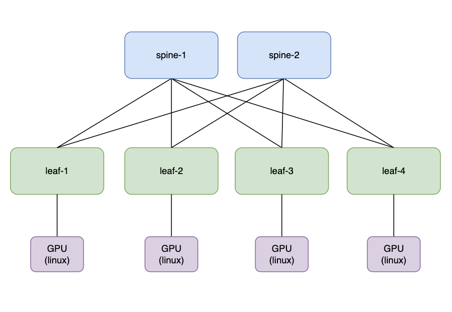
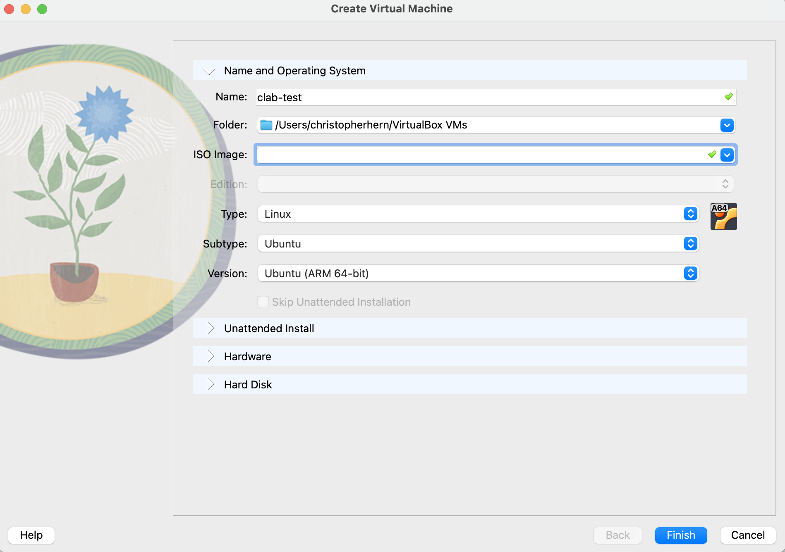
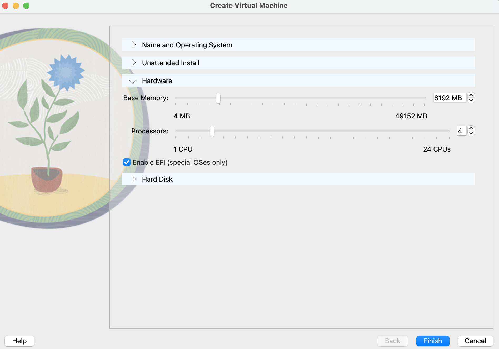
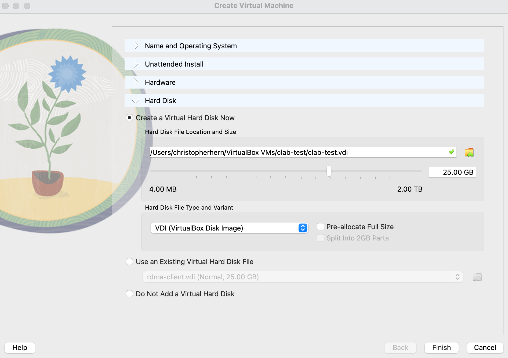
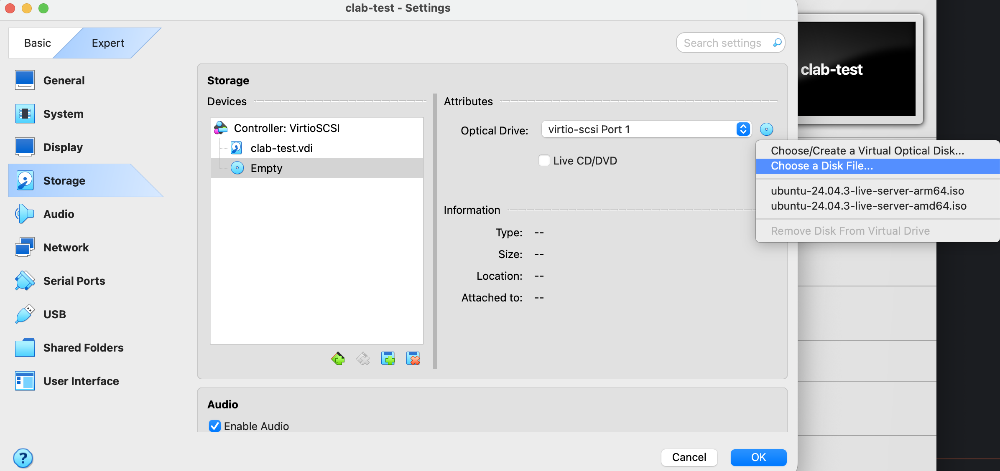
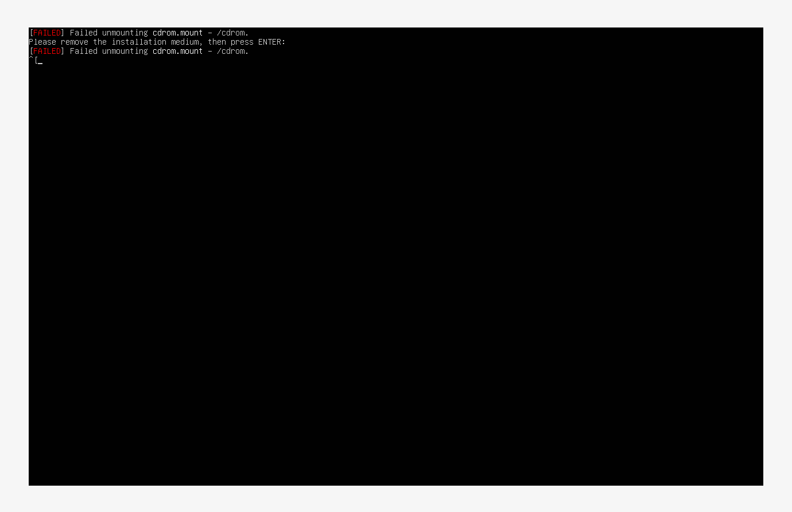
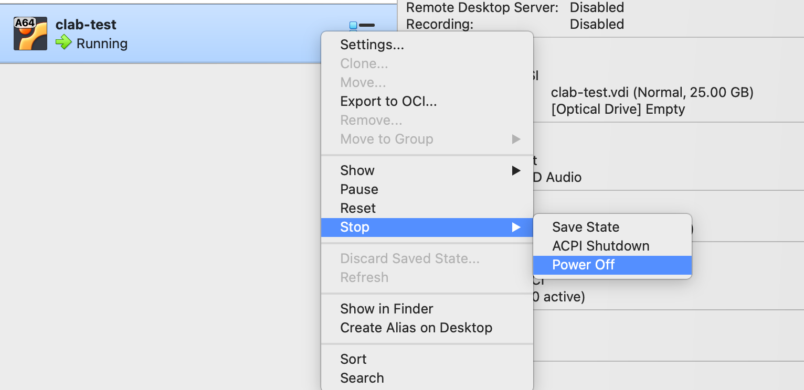
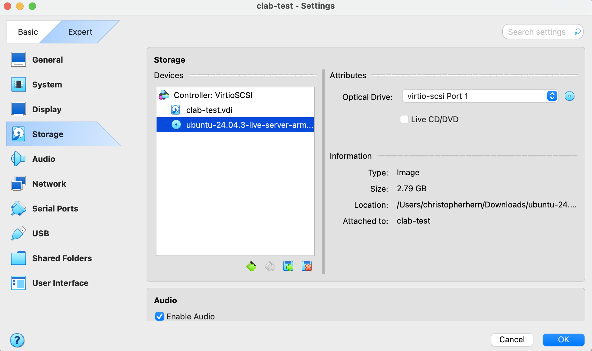

# Arista CLAB Lab
If you want to experiment with a protocol or technology in the networking space, this lab setup can help quickly build the scaffolding. 

It leverages containerlag, which uses docker under the hood to spin up nodes. You define the nodes and edges with a manifest file declared in YAML. 

- [containlab](https://containerlab.dev)

There is some manual setup if you're using VirtualBox. If you're using multipass, it becomes much easier. 

## What we're building


## Downloads
- oracle VirtualBox
- linux [image](https://cdimage.ubuntu.com/releases/24.04/release/ubuntu-24.04.3-live-server-arm64.iso)
- Container EOS image: [cEOSarm-lab-4.34.2.1F.tar.xz]() #TODO: add link

## Setup Steps
1. Download Oracle VirtualBox.
2. Download ubuntu image.
3. Download container EOS image. 
4. Create new VM with image in VirtualBox 
   1. Open VirtualBox and click on "New".
   2. Name your VM (e.g., "clab-test").
   3. Set the Type to "Linux", subtype to "Ubuntu" and Version to "Ubuntu (64-bit)".
   4. Allocate memory (RAM) to the VM (16 GB recommended).
   5. Allocate cores (CPUs) to the VM (16 recommended).
   6. Create a virtual hard disk (VDI format, dynamically allocated, at least 25 GB).
5. Attach the Ubuntu Server ISO:
   1. Select your newly created VM and click on "Settings".
   2. Navigate to "Storage".
   3. Under "Controller: IDE", click on the empty disk icon.
   4. Click on the disk icon next to "Optical Drive" and choose "Choose a disk file...".
   5. Select the Ubuntu Server ISO you downloaded earlier.
6. Walk through the setup of your machine prompt by prompt. 

### Walkthfough with images
- 
- 
- 
- 
- 
- 
- 
  - click the disk with the red X. 
  - Rick click on the VM and go to start. 
  - Boot into the next disk. 
  

Once the VM is up. 
1. disconnect from the VPN. 
2. push your ssh key to the machine
   1. 
   ```bash
    ssh-copy-id -i <path-to-pub-key-file>.pub <username>@<vm-IP>
   ```
3. SSH the EOS image on to the VM
   1. Example:
   ```bash
   (ncpcli) christopherhern@Christophers-MacBook-Pro arista-lab % scp ~/Downloads/cEOSarm-lab-4.34.2.1F.tar.xz <username>@<vm-IP>:<homedir>
   This key is not known by any other names.
      cEOSarm-lab-4.34.2.1F.tar.xz                                                                                                                                                                                 100%  550MB  67.9MB/s   00:08
   ```
4. Run the setup script. 
   1. 
   ```bash
   chern@clab-test:~/src/github.com/montybeatnik/arista-lab$ chmod +x setup-clab-on-vritualbox.sh
   chern@clab-test:~/src/github.com/montybeatnik/arista-lab$ ./setup-clab-on-vritualbox.sh
   ```


You should see something simliar to the following:
```bash
╭──────────────────────────────┬─────────────────────┬─────────┬───────────────────╮
│             Name             │      Kind/Image     │  State  │   IPv4/6 Address  │
├──────────────────────────────┼─────────────────────┼─────────┼───────────────────┤
│ clab-evpn-rdma-fabric-gpu1   │ linux               │ running │ 172.20.20.11      │
│                              │ alpine:3.19         │         │ 3fff:172:20:20::b │
├──────────────────────────────┼─────────────────────┼─────────┼───────────────────┤
│ clab-evpn-rdma-fabric-gpu2   │ linux               │ running │ 172.20.20.3       │
│                              │ alpine:3.19         │         │ 3fff:172:20:20::3 │
├──────────────────────────────┼─────────────────────┼─────────┼───────────────────┤
│ clab-evpn-rdma-fabric-gpu3   │ linux               │ running │ 172.20.20.2       │
│                              │ alpine:3.19         │         │ 3fff:172:20:20::2 │
├──────────────────────────────┼─────────────────────┼─────────┼───────────────────┤
│ clab-evpn-rdma-fabric-gpu4   │ linux               │ running │ 172.20.20.8       │
│                              │ alpine:3.19         │         │ 3fff:172:20:20::8 │
├──────────────────────────────┼─────────────────────┼─────────┼───────────────────┤
│ clab-evpn-rdma-fabric-leaf1  │ ceos                │ running │ 172.20.20.7       │
│                              │ ceosimage:4.34.2.1f │         │ 3fff:172:20:20::7 │
├──────────────────────────────┼─────────────────────┼─────────┼───────────────────┤
│ clab-evpn-rdma-fabric-leaf2  │ ceos                │ running │ 172.20.20.4       │
│                              │ ceosimage:4.34.2.1f │         │ 3fff:172:20:20::4 │
├──────────────────────────────┼─────────────────────┼─────────┼───────────────────┤
│ clab-evpn-rdma-fabric-leaf3  │ ceos                │ running │ 172.20.20.10      │
│                              │ ceosimage:4.34.2.1f │         │ 3fff:172:20:20::a │
├──────────────────────────────┼─────────────────────┼─────────┼───────────────────┤
│ clab-evpn-rdma-fabric-leaf4  │ ceos                │ running │ 172.20.20.5       │
│                              │ ceosimage:4.34.2.1f │         │ 3fff:172:20:20::5 │
├──────────────────────────────┼─────────────────────┼─────────┼───────────────────┤
│ clab-evpn-rdma-fabric-spine1 │ ceos                │ running │ 172.20.20.9       │
│                              │ ceosimage:4.34.2.1f │         │ 3fff:172:20:20::9 │
├──────────────────────────────┼─────────────────────┼─────────┼───────────────────┤
│ clab-evpn-rdma-fabric-spine2 │ ceos                │ running │ 172.20.20.6       │
│                              │ ceosimage:4.34.2.1f │         │ 3fff:172:20:20::6 │
╰──────────────────────────────┴─────────────────────┴─────────┴───────────────────╯
```

```bash
# 1) watch tx packet counter
sudo docker exec -it clab-evpn-rdma-fabric-gpu4 sh -lc '
  cat /sys/class/net/eth1/statistics/tx_packets ;
  ping -c3 -W1 10.10.10.101 || true ;
  cat /sys/class/net/eth1/statistics/tx_packets
'

# 2) force a gratuitous ARP + broadcast
sudo docker exec -it clab-evpn-rdma-fabric-gpu4 sh -lc '
  ip neigh flush all ;
  arping -c 3 -I eth1 10.10.10.104 || true
'  # if arping missing, apk add iputils-arping
```

```bash
# deploy lab
sudo containerlab deploy -t lab.clab.yml # may need to add --reconfigure
# inspect lab 
sudo containerlab inspect -t lab.clab.yml
# destroy lab
sudo containerlab destroy -t lab.clab.yml
# view topo 
sudo containerlab graph -t lab.clab.yml
```

## Creds 
- user: admin
- pass: admin

## Verify 
```text
show bgp summary
show ip route 10.0.0.1
show ip route 10.0.0.2
show bgp evpn summary
show bgp evpn route-type mac-ip
show vxlan vtep
show vxlan address-table
```

### From GPU1 
```bash
sudo docker exec -it clab-evpn-rdma-fabric-gpu1 sh -lc 'ping -c3 10.10.10.104'
```

## Debug 
### Restart docker 
```bash
sudo snap restart docker
```

## MTU ISSUES
```bash
sudo docker exec -it clab-evpn-rdma-fabric-gpu1 sh -lc 'ip link set eth1 mtu 500'
sudo docker exec -it clab-evpn-rdma-fabric-gpu2 sh -lc 'ip link set eth1 mtu 500'
sudo docker exec -it clab-evpn-rdma-fabric-gpu3 sh -lc 'ip link set eth1 mtu 500'
sudo docker exec -it clab-evpn-rdma-fabric-gpu4 sh -lc 'ip link set eth1 mtu 500'
```

```
leaf1#show vxlan config-sanity
! Your configuration contains warnings. This does not mean misconfigurations. But you may wish to re-check your configurations.
Category                            Result  Detail
---------------------------------- -------- ----------------------------------
Local VTEP Configuration Check       FAIL
  Flood List                         FAIL   No flood list configured
  Flood List                         FAIL   No remote VTEP in VLAN 10
```

### Unable to start lab try this:
```bash
# inside the VM
mkdir -p ~/.clab-runs
export CLAB_LABDIR_BASE="$HOME/.clab-runs"   # where Containerlab will write the clab-<name>/ dir
sudo -E containerlab destroy -t ~/lab/lab.clab.yml || true
sudo -E containerlab deploy  -t ~/lab/lab.clab.yml --reconfigure
```

## TODO:
- [ ] add multiple topologies
  - [ ] base IP setup between devices
  - [ ] ISIS as IGP 
  - [ ] OSPF as IGP 
  - [ ] Baisc RSVP/MPLS with an IGP
  - [ ] Segment Routing with MPLS
  - [ ] Segment Routing with IPv6